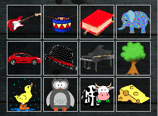
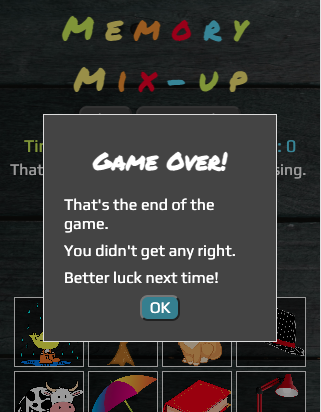

# Memory Mix-up

  

Memory Mix-up is a browser based memory game for children and adults, based on the traditional [Kim's Game](https://en.wikipedia.org/wiki/Kim%27s_Game). 

A random selection of objects is placed on the game board, and the player has 30 seconds to memorise them. An object is then removed, the order of the remaining objects is mixed up, and the player guesses which object they think is missing. 

In this implementation, the player is given a choice of three possible answers, one of which is the original object, while the other two are random objects not among those on the game board. The player has five turns, with a score out of five at the end of the game.

## Table of Contents

## Objectives

The objectives of the site are:

1. To present the user with a simple and fun game which tests and exercises the memory.
2. To provide simple and clear instructions, and clearly guide the player along the path through the game.
3. To present the game in a visually appealing and uncluttered style.
4. To deliver a responsive design that allows the game to be played on as wide a range of devices as possible, while maintaining the visual appeal and integrity of the site.

**Link to deployed site:** (https://andy-guttridge.github.io/memory-mixup/)

## Features 

### Mobile first design

The game was designed around the iPhone 5/SE screen size to ensure it is playable and appealing on as wide a range of devices as possible.

The mobile first design addresses objectives 2, 3 and 4.

  

### Colourful header/logo

The game features a colourful header/logo, designed to be both eye catching and clear to read. The logo is a clickable link to the site, however as there is only a single page it is unlikely this feature will be used much, and for that reason a decision was taken not to compromise the visual appeal of the logo by underlining it or having it highlighted by the mouse pointer.

The logo addresses objectives 3 and 4.

  

### Controls and information area

Under the main logo is an area containing the main controls for the game, a 'Play!' button to start the game and a 'How to play' button to enable the instructions to be viewed at any time.
This area also features some key information - the amount of time left for the current turn, the number of turns left and the score. This key information is presented in three of the colours used for the logo, in keeping with the visual style of the site.

This controls and information area addresses objectives 1, 2 and 3.

  

### Answer area

Under the controls and information area is the answer area. This features the three buttons from which the player is able to select their answer for each turn at the appropriate time. These buttons are only selectable when it is time to choose an answer. They are disabled and populated with a question mark image at other times.

The answer area also features two dynamic message areas where various in game messages are displayed to guide the player through the game, and offer feedback as to their performance. This includes the correct answer when the player makes an incorrect choice, and a timer to count down to the next turn after the player has given their answer.

The answer area addresses objectives 1, 2, 3 and 4.

  
  
  
  

### Main game board

The main game board is the area where a random selection of objects for the player to memorise is placed. When an item is removed, the order of the objects is randomised and one object is removed and replaced with a red cross to indicate the missing object.

This feature addresses objectives 1, 3 and 4.

  
  

### Footer

The site features a footer with a link to the creator's GitHub profile. The footer is responsive to device size and therefore addresses objective 4.

  

### How To Play modal dialog

Instructions for the game are provided by a modal dialog which appears when the page first loads, and can be easily invoked by the player at any time via the 'How to play' button at the top of the website. The modal dialog is responsive to the size of the device, ensuring the instructions can be easily read on a wide range of devices.

This feature addresses objectives 2, 3 and 4.

  

### Game over modal dialog

After the final turn of the game, the player is presented with a modal dialog containing an end of game message with the total score. There is a different version of the message if the player hasn't scored anything.

The game over modal dialog addresses objectives 2, 3 and 4.

  
  

### 404 Error page
A 404 error page to notify the user if they attempt to access a non-existent page or file. This is styled so that it clearly belongs to Memory Mix-up, and provides the user with a link back to the main site.

The 404 error page addresses objectives 2 and 4.

  

## Design

### Responsiveness

A key aim for Memory Mix-up is for it to be playable and attractively presented on as wide a variety of devices as possible, in the interests of inclusivity. A mobile first approach was taken, with the iPhone 5/SE chosen as the 'base' target for the site, as this is an older device at the smaller end of the range of screen sizes available within the Google Chrome development tools. 

One of the original objectives was for the site to fit onto the screen of all devices simulated within the Google Chrome development tools without any vertical scrolling, as the need to scroll was felt to detract from the game. Testing revealed that eliminating vertical scrolling resulted in the game being so small as to be practically unplayable on very small devices such as the JioPhone2, therefore this objective was relaxed. The revised aim was to minimise the need for vertical scrolling for the majority of devices, but to accept that it may be necessary in some cases. 

This objective included aiming for an attractive presentation on landscape devices as well as portrait, though achieving no vertical scrolling on every device in both portrait and landscape orientations proved impractical. However the site provides a good experience for the vast majority of devices in portrait orientation, with many also able to view the site in landscape with little or no vertical scrolling, and specific attention given to landscape only devices (e.g. the Nest Hub). 

Creating a responsive and inclusive design was a particularly challenging aspect of the project, given the desire to manage the vertical dimensions of the game and minimise vertical scrolling as well as respond to the width of devices.

The following media queries were implemented to achieve responsivity and inclusiveness, with specific changes to the sizing of the logo, fonts, the answer buttons and the game board items to fit as many devices as possible:

- For devices between 550px and 899px width in portrait orientation
- For devices wider than 899px in portrait orientation
- For devices of 1100px height or more in portrait orientation
- For devices with a height less than 568px and at least 480px in portrait orientation
- For devices with a height less than 480px in portrait orientation 
- For devices with a width of 1000px or greater and no taller than 900px (e.g. the Nest Hub)
- For devices up to 550px wide in landscape orientation
- For devices between 550px and 749px wide in landscape orientation
- For devices between 750px and 960px wide in landscape orientation

### Planning

The features of the site were 'mocked-up' using a basic wireframe of the features of the site when displayed on a mobile screen prior to implementation. Some minor changes were made to the layout of the site after development began in order to improve the game experience, for example the 'answer area' was up above the main game board, and the number of items on the game board was reduced from 16 to 12.

  

### Colours and background

A mix of vivid colours for the logo and the player information was chosen, based on experimentation to achieve an attractive selection and sufficient contrast against the grey background. The colours are:

- Green: `#dbf73b` 
- Yellow: `#ffee64`
- Orange: `#ff9b0b`
- Red: `#ff0d21`
- Blue: `#6eddff`

White text was chosen for other in game text and the borders for the answer buttons and the game board items, to provide maximum contrast against the dark background.

A dark red (`#8c0712`) and a dark blue (`#3f7e91`) were chosen for the 'Play!' and 'How to play' buttons, to complement the colours in the logo and provide contrast against the writing on the buttons. A dark grey (`#444`) background and light grey text (`#ddd`) were chosen for the buttons in their disabled state to clearly indicate when they are not selectable.

The standard CSS `aqua` colour was chosen for standard text links on the basis that this is a higher contrast variation of the blue colour typically used for links, with the CSS `magenta` colour used as the 'hover over' colour to provide an obvious contrast.

A dark black and white image of some wooden planks was chosen as a background for the site, in order to provide a pleasant, non-distracting and high contrast background suitable for a wide range of screen sizes. The `body` of the site has a very dark grey (`rgb(2, 4, 64)`) fallback colour to ensure a high contrast with the foreground elements should the background fail to load. 

The answer buttons and the items on the main game board have a dark semi-transcluscent background (`rgb(0, 0, 0, 0.5)`) to ensure sufficient contrast against the background image.

### Fonts

### Features Left to Implement

## Testing 

### Validator Testing 

#### W3C HTML Validator

#### W3C CSS Validator

#### JSHint JavaScript Validator

### Accessibility testing

### Other testing

### Unfixed Bugs

## Deployment

- The site can be deployed to GitHub pages as follows: 
  - Select the 'Settings' tab in the GitHub repository
  - Select 'Pages' under the 'Code and automation' heading 
  - Select the 'Main' branch from the 'Source' drop-down menu
  
  The site will then be deployed with a message displayed indicating success and providing the URL of the deployed site.

- A copy of the site can be downloaded for use in a local environment as follows:
  - Locate the repository in GitHub and select it
  - Select 'Code'
  - Select 'Download ZIP' from the dropdown menu
  - The ZIP file can now be extracted and utilised in your local environment

## Credits 

### Code

### Content 

### Media

Images used in the completed website are:

#### Thanks to [Adegbenga Adeye](https://ng.linkedin.com/in/adegbenga-adeye-psm-i-14003635?original_referer=https%3A%2F%2Fwww.google.com%2F) for guidance throughout the project.
