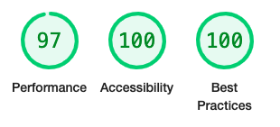

# Memory Mix-up

  

Memory Mix-up is a browser based memory game for children and adults, based on the traditional [Kim's Game](https://en.wikipedia.org/wiki/Kim%27s_Game). 

A random selection of items is placed on the game board, and the player has 20 seconds to memorise them. An item is then removed, the order of the remaining objects is mixed up, and the player guesses which item they think is missing. 

In this implementation, the player is given a choice of three possible answers, one of which is the correct item, while the other two are random items not among those on the game board. The player has five turns, with a score out of five at the end of the game.

## Objectives

The objectives of the site are:

1. To present the user with a simple and fun game which tests and exercises the memory.
2. To provide simple and clear instructions, and clearly guide the player along the path through the game.
3. To present the game in a visually appealing and uncluttered style.
4. To deliver a responsive design that allows the game to be played on as wide a range of devices as possible, while maintaining the visual appeal and integrity of the site.

**Link to deployed site:** (https://andy-guttridge.github.io/memory-mixup/)

## Table of Contents

- [Features](#features)
  - [Mobile first design](#mobile-first-design)
  - [Colourful logo](#colourful-logo)
  - [Controls and information area](#controls-and-information-area)
  - [Answer area](#answer-area)
  - [Main game board](#main-game-board)
  - [Footer](#footer)
  - [How To Play modal dialog](#how-to-play-modal-dialog)
  - [Game Over modal dialog](#game-over-modal-dialog)
  - [404 error page](#404-error-page)
- [Design](#design)
  - [Responsiveness](#responsiveness)
  - [Planning](#planning)
  - [Colours and background](#colours-and-background)
  - [Fonts](#fonts)
  - [Features left to implement](#features-left-to-implement)
- [Testing](#testing)
  - [Validator testing](#validator-testing)
    - [W3C HTML validator](#w3c-html-validator)
    - [W3C CSS validator](#w3c-css-validator)
    - [JSHint JavaScript validator](#jshint-javascript-validator)
  - [Lighthouse testing](#lighthouse-testing)
  - [Unfixed bugs](#unfixed-bugs)
- [Deployment](#deployment)
- [Credits](#credits)
  - [Code](#code)
  - [Media](#media)

## Features 

### Mobile first design

The game was designed around the iPhone 5/SE in portrait orientation to ensure it is playable and appealing on as wide a range of devices as possible.

The mobile first design addresses objectives 2, 3 and 4.

  

### Colourful logo

The game features a colourful header/logo, designed to be both eye catching and clear to read. The logo is a clickable link to the site, however as there is only a single page it is unlikely this feature will be used much, and for that reason a decision was taken not to compromise the visual appeal of the logo by underlining it or having it highlighted by the mouse pointer.

The logo addresses objectives 3 and 4.

  

### Controls and information area

Under the main logo is an area containing the main controls for the game, a 'Play!' button to start the game and a 'How to play' button to enable the instructions to be viewed at any time.
This area also features some key information - the amount of time left for the current turn, the number of turns left and the score. This key information is presented in three of the colours used for the logo, in keeping with the visual style of the site.

This controls and information area addresses objectives 1, 2 and 3.

  

### Answer area

Under the controls and information area is the answer area. This features the three buttons from which the player is able to select their answer for each turn at the appropriate time. These buttons are only selectable when it is time to choose an answer. They are disabled and populated with a question mark image at other times.

The answer area also features two dynamic message areas where various in game messages are displayed to guide the player through the game, and offer feedback as to their performance. This includes the correct answer when the player makes an incorrect choice, and a timer to count down to the next turn after the player has given their answer.

The answer area addresses objectives 1, 2, 3 and 4.

  
  
  
  

### Main game board

The main game board is the area where a random selection of objects for the player to memorise is placed. When an item is removed, the order of the objects is randomised and one object is removed and replaced with a red cross to indicate the missing object.

This feature addresses objectives 1, 3 and 4.

  
  

### Footer

The site features a footer with a link to the creator's GitHub profile. The footer is responsive to device size and therefore addresses objective 4.

  

### How To Play modal dialog

Instructions for the game are provided by a modal dialog which appears when the page first loads, and can be easily invoked by the player at any time via the 'How to play' button at the top of the website. The modal dialog is responsive to the size of the device, ensuring the instructions can be easily read on a wide range of devices.

The modal dialog can be dismissed either by clicking the 'I'm ready' button or by clicking outside of the dialog, in line with common UX convention.

This feature addresses objectives 2, 3 and 4.

  

### Game over modal dialog

After the final turn of the game, the player is presented with a modal dialog containing an end of game message with the total score. There is a different version of the message if the player hasn't scored anything.

This modal dialog can also be dismissed by clicking outside of the dialog.

The game over modal dialog addresses objectives 2, 3 and 4.

  
  

### 404 Error page
A 404 error page to notify the user if they attempt to access a non-existent page or file. This is styled so that it clearly belongs to Memory Mix-up, and provides the user with a link back to the main site.

The 404 error page addresses objectives 2 and 4.

  

## Design

### Responsiveness

A key aim for Memory Mix-up is for it to be playable and attractively presented on as wide a variety of devices as possible, in the interests of inclusivity. A mobile first approach was taken, with the iPhone 5/SE in portrait orientation chosen as the 'base' target for the site, as this is an older device at the smaller end of the range of screen sizes available within the Google Chrome development tools. 

One of the original objectives was for the site to fit onto the screen of all devices simulated within the Google Chrome development tools without any vertical scrolling, as the need to scroll was felt to detract from the game. Testing revealed that eliminating vertical scrolling resulted in the game being so small as to be practically unplayable on very small devices such as the JioPhone2, therefore this objective was relaxed. The revised aim was to minimise the need for vertical scrolling for the majority of devices, but to accept that it may be necessary in some cases. 

This objective included aiming for an attractive presentation on landscape devices as well as portrait, though achieving no vertical scrolling on every device in both portrait and landscape orientations proved impractical. However the site provides a pleasing experience for the vast majority of devices in portrait orientation, with many also able to view the site in landscape with little or no vertical scrolling, and specific attention given to landscape only devices (e.g. the Nest Hub). 

Creating a responsive and inclusive design was a particularly challenging aspect of the project, given the desire to manage the vertical dimensions of the game and minimise vertical scrolling as well as respond to the width of devices.

The following media queries were implemented to achieve responsivity and inclusiveness, with specific changes to the sizing of the logo, fonts, the answer buttons and the game board items to fit as many devices as possible:

- For devices between 550px and 899px width in portrait orientation
- For devices wider than 899px
- For devices of 1100px height or more in portrait orientation
- For devices with a height less than 568px and at least 480px in portrait orientation
- For devices with a height less than 480px in portrait orientation 
- For devices with a width of 1000px or greater and no taller than 900px (e.g. the Nest Hub)
- For devices up to 550px wide in landscape orientation
- For devices between 550px and 749px wide in landscape orientation
- For devices between 750px and 960px wide in landscape orientation

### Planning

The features of the site were 'mocked-up' using a basic wireframe of the features of the site when displayed on a mobile screen prior to implementation. Some minor changes were made to the layout of the site after development began in order to improve the game experience, for example the 'answer area' was moved above the main game board, and the number of items on the game board was reduced from 16 to 12.

  

### Colours and background

A mix of vivid colours for the logo and the player information was chosen, based on experimentation to achieve an attractive selection and sufficient contrast against the grey background. The colours are:

- Green: `#dbf73b` 
- Yellow: `#ffee64`
- Orange: `#ff9b0b`
- Red: `#ff0d21`
- Blue: `#6eddff`

White was chosen for other in game text and the borders for the answer buttons and the game board items, to provide maximum contrast against the dark background.

A dark red (`#8c0712`) and a dark blue (`#3f7e91`) were chosen for the 'Play!' and 'How to play' buttons, to complement the colours in the logo and provide contrast against the writing on the buttons. A dark grey (`#444`) background and light grey text (`#ddd`) were chosen for the buttons in their disabled state to clearly indicate when they are not selectable.

The standard CSS `aqua` colour was chosen for standard text links on the basis that this is a higher contrast variation of the blue colour typically used for links, with the CSS `magenta` colour used as the 'hover over' colour to provide an obvious contrast.

A dark black and white image of some wooden planks was chosen as a background for the site, in order to provide a pleasant, non-distracting and high contrast background suitable for a wide range of screen sizes. The `body` of the site has a very dark blue (`rgb(2, 4, 64)`) fallback colour to ensure a high contrast with the foreground elements should the background fail to load. 

The answer buttons and the items on the main game board have a dark semi-transcluscent background (`rgba(0, 0, 0, 0.5)`) to ensure sufficient contrast against the background image.

### Fonts

Fonts were sourced from [Google Fonts](https://fonts.google.com/). 'Permanent Marker' was chosen for the logo and headings for its playful quality, and 'Play' was chosen for the rest of the text because it is highly legible yet friendly looking.   

A favicon using the 'Permanent Marker' font was created using [Favicon Generator](https://favicon.io/favicon-generator/).

### Features Left to Implement

With the relaxation of the aim to eliminate all vertical scrolling, all planned features were successfully implemented.
Ideas for future development could include:

- Allowing the player to enter their name at the start of a new game, and using this to populate a high scores league table.
- Implementing a difficulty level option based on allowing more or less time for each turn.
- Implementing a CSS 'card flipping' animation as a transition between each turn and when the game board items are randomised.

## Testing 

The development and deployed versions of the site were tested regularly throughout development using Google Chrome on Mac OS, and in Safari on Mac OS and on an iPhone XR. The Google Chrome development tools were used to preview the site on a wide range of mobile device sizes including the JeoPhone 2, Galaxy Fold, iPhone 4, iPhone 5/SE, iPhone XR, the Nest Hub, Microsoft Lumia 550, Samsung Galaxy A51/71, Pixel 5, iPad, iPad Air and iPad Pro (among others). In addition to enabling a large range of devices to be covered by the media queries, use of the responsive setting in the development tools revealed that the site looked quite sparse on monitors wider than 1500px, so a decision was taken to limit the width of the `<body>` element to 1500px and centre the site on large monitors.

The time allowed per turn was typically set to just a few seconds throughout testing, to allow whole turns and games to be played through quickly. This enabled a wide range of game states and sequences of player actions to be tested. `console.log()` statements were used liberally throughout testing to examine the condition of specific variables at key steps. One key piece of data output to the console is the correct answer for each turn - this enabled rapid testing of the game's responses to both correct and incorrect answers. This `console.log()` has been left in, as it is assumed the average player would not activate the console.

Bugs encountered and fixed during development included:

- A bug causing the timer not to decrement in the JavaScript `runTimer()` function. The Google Chrome JavaScript debugger was used to step through each instruction, which enabled the bug to be isolated and fixed.
- A bug causing the 'Play!' button not to be enabled after completing a game and then selecting the 'How to play' button. An `isPlaying` boolean variable was added to the `PLAYER_STATE` object to track whether a game is currently in progress. This allows a straightforward test of whether a game is in progress, and if it is not then to allow the 'Play!' button to be re-enabled after the 'How to play' modal dialog is dismissed.

### Validator Testing 

#### W3C HTML Validator

The W3C HTML validator revealed that the `
` elements used to present information such as the score, time left and number of turns left in the controls and information area and in the modal dialog required a `role` attribute to be used in conjunction with the `aria-label` attribute. Suitable `role` values were added. 

Additionally and late in development, the validator demonstrated that the `
` elements used to contain the logo and the `<a>` elements used to turn the logo into a link were not nested and closed correctly. 

With these errors having been addressed, both the `index.html` and `404.html` pages pass validation with no issues. 

#### W3C CSS Validator

The W3C validator found no issues with `assets/css/styles.css`.

#### JSHint JavaScript Validator

JSHint was configured to assume that ES6 JavaScript features are acceptable, given these were introduced in 2015.
JSHint produced one warning about the use of ES8 syntax (`async function`). [caniuse.com](https://caniuse.com/async-functions) demonstrates this feature is implemented by the majority of browsers and estimates it is available for 96.15% of users across mobile and desktop devices. This was felt to be an acceptably high proportion.

JSHint demonstrated that all functions within `assets/scripts/script.js` had a cyclomatic complexity of 5 or below, with the exception of the `getAnswerFromPlayer()` function, which had a cyclomatic complexity of 7. Researching the topic revealed [this blog post](https://elijahmanor.com/blog/control-the-complexity-of-your-javascript-functions-with-jshint) from Elijah Manor, which cites a recommendation in Code Complete by Steve McConnell that a cyclomatic complexity above 5 is worthy of further investigation.

The `getAnswerFromPlayer()` function was refactored and some functionality split out into a new `checkItemValid()` function. This reduced the cyclomatic complexity of `getAnswerFromPlayer()` down to 5, but at the expense of introducing a new function also with a cyclomatic complexity of 5 and requiring 4 parameters. This was deemed acceptable for the time being, however further refactoring these two functions would have been a focus given more time, and may be worth revisiting in future.

JSHint also detected numerous missing semi-colons, which were inserted.

### Lighthouse testing

The Lighthouse report in the Google Chrome developer tools highlighted that a number of `aria-labels` on the `
` elements used for the game board items did not match the aria `role` attribute. Given the images in these elements change frequently, `aria-label` attributes are added programmatically via JavaScript, and no `role` attribute had been set.

  

This was rectified by adding `role` attributes to the `
` elements in `index.html`, while stilling setting the `aria-label` attribute programmatically, and the Lighthouse score for accessability increased to 100%, along with 97% for performance and 100% for best practices.

  

97% for performance was deemed acceptable, however potential improvements and areas to investigate identified by Lighthouse and which could be reviewed in future include:

- Serving images in next generation formats
- Serve static assets with an efficient cache policy
- Keep request counts low and transfer sizes small
- The game board area was identified as the 'largest contentful paint' element
- Avoid large layout shifts - note that large layout shifts are required for Memory Mix-up

### Unfixed Bugs

All bugs identified during development and testing have been fixed.

The Google Chrome browser console displayed the following warning for the deployed site:

  

This occurs because Google's Federated Learning of Cohorts (FLoC) tracking technology is disabled by default on Github Pages to protect user's privacy. This does not impact the functioning of the website. Further information about FLoC is available at:

[What is FLoC?](https://web.dev/floc/#do-websites-have-to-participate-and-share-information)
[GitHub community post](https://github.community/t/i-have-no-idea-what-the-interest-cohort-is/179780)

## Deployment

- The site can be deployed to GitHub pages as follows: 
  - Select the 'Settings' tab in the GitHub repository
  - Select 'Pages' under the 'Code and automation' heading 
  - Select the 'Main' branch from the 'Source' drop-down menu
  
  The site will then be deployed with a message displayed indicating success and providing the URL of the deployed site.

- A copy of the site can be downloaded for use in a local environment as follows:
  - Locate the repository in GitHub and select it
  - Select 'Code'
  - Select 'Download ZIP' from the dropdown menu
  - The ZIP file can now be extracted and utilised in your local environment

## Credits 

### Code

- HTML and CSS code to create a modal dialog was adapated from a [W3 Schools tutoral](https://www.w3schools.com/howto/howto_css_modals.asp)
- Code to import Google Fonts and font-family attribute values were copied and pasted from [Google Fonts](https://fonts.google.com/)
- The algorithm to randomly shuffle an array in the `takeOneItem()` function was taken from [Stack Overflow](https://stackoverflow.com/questions/2450954/how-to-randomize-shuffle-a-javascript-array)
- Code to implement an asynchronous timer was adapted from a [Mastering JS](https://masteringjs.io/tutorials/fundamentals/wait-1-second-then#:~:text=To%20delay%20a%20function%20execution,call%20fn%20after%201%20second) article
- This [mdn web docs](https://developer.mozilla.org/en-US/docs/Glossary/Callback_function) article on callback functions was referenced when implementing the `runTimer` function
- This [Stack Overflow](https://stackoverflow.com/questions/13286233/pass-a-javascript-function-as-parameter) question was referenced to discover how to use an anonymous function as a wrapper for passing a function with arguments as the value for a callback when implementing the the call of `runTimer()` in the `playGame()` function
- This [Stack Overflow](https://stackoverflow.com/questions/4190792/should-i-use-a-global-variable-and-if-not-what-instead-javascript) question was referenced with respect to options for avoiding global variables, resulting in the decision to wrap all of the JavaScript inside an anonymous function
- The code to dismiss the modal dialog when the player clicks outside of the dialog was adapted from https://techstacker.com/close-modal-click-outside-vanilla-javascript/
- The line of code to link to the favicon from the `<head>` element was based on [this tutorial](https://www.digitalocean.com/community/tutorials/how-to-add-a-favicon-to-your-website-with-html) from Digital Ocean.

### Media

#### Images used for the game board items are:

Book: https://pixabay.com/vectors/book-read-library-reading-2028193/

Car: https://pixabay.com/vectors/automobile-car-red-french-old-1300467/

Cat: https://pixabay.com/vectors/kitten-cute-cat-animals-furry-4794761/

Cheese: https://pixabay.com/vectors/cheese-dairy-dairy-product-151032/

Cow: https://pixabay.com/vectors/cow-grass-eating-animal-159893/

Cross: https://pixabay.com/vectors/check-cross-red-green-attention-158879/

Drum: https://pixabay.com/vectors/drum-instrument-music-musical-1294954/

Duck: https://pixabay.com/vectors/rain-duck-puddle-boots-water-bird-312098/

Elephant: https://pixabay.com/vectors/abstract-animal-art-blue-1296709/

Fish: https://pixabay.com/vectors/goldfish-fish-koi-carp-30837/

Fork: https://pixabay.com/vectors/fork-cutlery-kitchenware-piece-41080/

Guitar: https://pixabay.com/vectors/guitar-music-rock-2024189/

Hat: https://pixabay.com/vectors/hat-clothing-fedora-elegant-158569/

House: https://pixabay.com/vectors/cottage-house-home-building-little-160367/

Lamp: https://pixabay.com/vectors/desk-lamp-lamp-night-office-red-147523/

Owl: https://pixabay.com/vectors/raccoon-owl-fox-application-1157728/

Piano: https://pixabay.com/vectors/grand-piano-piano-music-161447/

Question mark: https://pixabay.com/vectors/question-question-mark-punctuation-1243504/

Table: https://pixabay.com/vectors/table-grey-silver-flat-couch-308862/

Tree: https://pixabay.com/vectors/trees-forest-nature-woods-flora-146748/

Umbrella: https://pixabay.com/vectors/umbrella-color-rain-colorful-water-1767541/

#### Background Image

The background image is: https://www.pexels.com/photo/gray-wooden-surface-1250283/

#### Fonts

The fonts used are [Permanent Marker](https://fonts.google.com/specimen/Permanent+Marker?query=permanent+marker) and [Play](https://fonts.google.com/specimen/Play) from [Google Fonts](https://fonts.google.com/).

#### Thanks to [Adegbenga Adeye](https://ng.linkedin.com/in/adegbenga-adeye-psm-i-14003635?original_referer=https%3A%2F%2Fwww.google.com%2F) for guidance throughout the project.
